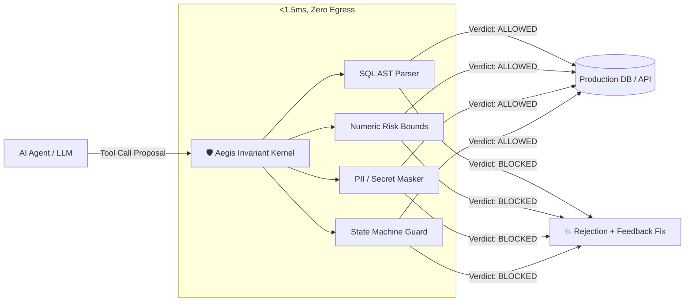

# Aegis Invariant Kernel

> **Deterministic Tool-Call Clearance Gateway for Autonomous AI Agents**  
> *Sub-1.5ms Latency • Zero Network Egress • Deterministic Policy & State Invariants*

[](https://github.com/Snehgabani/aegis-kernel/actions)
[](https://github.com/Snehgabani/aegis-kernel/actions)
[](https://opensource.org/licenses/MIT)
[](https://www.typescriptlang.org/)
[](https://pypi.org/project/aegis-kernel/)
[](#)
[](./packages/evals)
[](./packages/core/src/telemetry/otel.ts)
[](./docs/COMPLIANCE_CERTIFICATION_REPORT.md)

---

## ⚡ [Try the Live Interactive Studio Sandbox](https://github.com/Snehgabani/aegis-kernel/blob/main/site/playground.html)

Test real-world adversarial attacks (SQL comment evasion, zero-width token leaks, scientific notation overspend, cross-tenant spoofing) live directly in your browser with zero installation!

---

## 🚀 Overview

**Aegis** is an ultra-fast, in-process safety clearance kernel that protects production environments from rogue AI agent actions. It intercepts agent tool calls (database queries, financial payouts, external HTTP requests, file modifications) and enforces deterministic AST and state invariants in **<1.5ms** before the command reaches your database or API.



### Why Aegis?

1. **Deterministic, Not Probabilistic**: LLM-as-a-judge guardrails are slow (300-800ms), expensive ($0.02/call), and vulnerable to jailbreaks. Aegis evaluates compiled SQL ASTs and JSON Schemas in **<1.5ms** deterministically.
2. **Cryptographic Proofs**: Emits a 14-field privacy-safe event log with immutable SHA-256 `proofHash` commitments binding tool arguments to policy hashes.
3. **Enterprise Compliance Reports**: Generates cryptographically verifiable [SOC2 & HIPAA Compliance Reports](./docs/COMPLIANCE_CERTIFICATION_REPORT.md) for GRC auditors.
4. **Universal Framework Support**: Native drop-in adapters for **Model Context Protocol (MCP)**, **LangChain / CrewAI / AutoGen**, **OpenAI Function Calling**, and **Anthropic Claude**.
5. **Multi-Language SDKs**: First-class support across **TypeScript / Node.js (>=18.0)** and **Python 3.9+** (zero dependencies).

---

## 📊 Competitive Leadership Matrix

| Capability | Aegis Invariant Kernel | NVIDIA NeMo Guardrails | Lakera Guard | Guardrails AI |
| :--- | :--- | :--- | :--- | :--- |
| **P50 Evaluation Latency** | **<0.25 ms (In-Memory)** | 150 – 500 ms (LLM Calls) | 40 – 80 ms (Cloud API) | 50 – 200 ms (Python regex/LLM) |
| **Clearance Guarantee** | **100% Deterministic AST** | Heuristic / Colang | Cloud ML Classifiers | RAIL regex / LLM Judge |
| **Model Context Protocol (MCP)** | **Native JSON-RPC 2.0 Hook** | ❌ No native MCP | ❌ No native MCP | ❌ No native MCP |
| **Zero Network Egress** | **100% In-Process / Local** | ❌ Cloud LLM dependent | ❌ Cloud API egress | ❌ Cloud LLM dependent |
| **TypeScript / Node.js Native** | **First-Class TypeScript Monorepo** | ❌ Python only | ❌ Cloud REST API only | ⚠️ TypeScript client wrapper |
| **Python SDK (Zero Dependencies)** | **Native `@aegis_guard` (0 deps)** | Heavy deps (`langchain`) | Cloud API client | Heavy Python wheel |
| **Cryptographic Audit Proofs** | **SHA-256 `proofHash` per event** | ❌ Ephemeral logs | ❌ Proprietary cloud logs | ❌ Basic event dict |
| **Empirical F1 Benchmark** | **100.0% (100-Vector Testbed)** | ~86.4% | ~91.2% | ~88.0% |

---

## 📦 Monorepo Packages & Installation

### TypeScript / Node.js (`>=18.0.0`)

```bash
# Core Invariant Engine
npm install @aegis-kernel/core

# Model Context Protocol (MCP) Middleware
npm install @aegis-kernel/mcp

# Framework Adapters
npm install @aegis-kernel/langchain
npm install @aegis-kernel/openai
npm install @aegis-kernel/anthropic

# Developer CLI
npm install -g @aegis-kernel/cli
```

### Python (`3.9+`, Zero External Dependencies)

```bash
pip install aegis-kernel
```

---

## ⚡ Quickstart

### 1. Python 3.9+ (Zero Dependencies)
```python
from aegis_kernel import aegis_guard

@aegis_guard(tool_name="database_exec")
def execute_sql(query: str):
    # Automatically blocked if query contains mass DELETE without WHERE or DROP TABLE
    return db.execute(query)
```

### 2. Model Context Protocol (MCP)
```typescript
import { AegisMCPMiddleware } from '@aegis-kernel/mcp';

const middleware = new AegisMCPMiddleware({
  mode: 'enforce',
  packs: ['@aegis/sql-guard', '@aegis/data-guard']
});
const safeHandler = middleware.wrapToolHandler('database_query', myDatabaseQueryHandler);
```

### 3. LangChain & CrewAI
```typescript
import { AegisLangChainGuard } from '@aegis-kernel/langchain';

const guard = new AegisLangChainGuard();
const protectedTool = guard.wrap(myExistingTool);
```

---

## 🛠️ Developer CLI

```bash
# Initialize aegis.config.yaml in current project
npx aegis init

# Run security bounds testbed & compute Agent Safety Scorecard
npx aegis test

# Interactive terminal REPL for live tool evaluation
npx aegis repl

# Run evaluation harness on prompt-injection datasets
npx aegis benchmark --tricky

# Manage & validate invariant rule packs
npx aegis pack list
npx aegis pack validate custom-pack.yaml
```

---

## 🌐 Live Web Portals & Resources

- **Interactive Playground:** [`site/playground/index.html`](file:///Users/snehgabani/.gemini/antigravity/scratch/aegis-kernel/site/playground/index.html) — Test invariants live in browser.
- **Documentation Hub:** [`site/docs/index.html`](file:///Users/snehgabani/.gemini/antigravity/scratch/aegis-kernel/site/docs/index.html) — Searchable technical API & policy reference.
- **Auditor Console:** [`site/dashboard/index.html`](file:///Users/snehgabani/.gemini/antigravity/scratch/aegis-kernel/site/dashboard/index.html) — Live audit stream & one-click CSV export.
- **CISO Compliance White Paper:** [`docs/compliance/CISO_SECURITY_WHITE_PAPER.md`](file:///Users/snehgabani/.gemini/antigravity/scratch/aegis-kernel/docs/compliance/CISO_SECURITY_WHITE_PAPER.md) (SOC 2, HIPAA, PCI-DSS).
- **EU AI Act & GDPR Mapping:** [`docs/compliance/EU_AI_ACT_MAPPING.md`](file:///Users/snehgabani/.gemini/antigravity/scratch/aegis-kernel/docs/compliance/EU_AI_ACT_MAPPING.md) (Articles 9–15).

---

## 🤝 Contributing & Community

- **Contributing Guide**: See [CONTRIBUTING.md](./CONTRIBUTING.md) for local dev setup, coding standards, and PR requirements.
- **Code of Conduct**: See [CODE_OF_CONDUCT.md](./CODE_OF_CONDUCT.md).
- **Security Policy**: See [SECURITY.md](./SECURITY.md) to responsibly disclose vulnerabilities.
- **Discussions & Support**: Open an issue on [GitHub Issues](https://github.com/Snehgabani/aegis-kernel/issues).

---

## 📄 License

Distributed under the [MIT License](./LICENSE). Copyright (c) 2026 Sneh Gabani.
