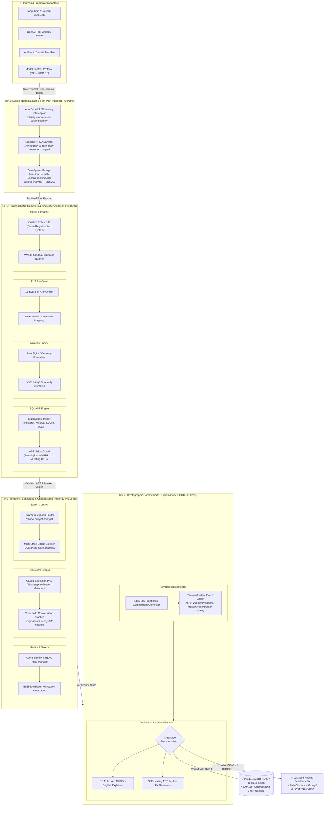

<div align="center">

# 🛡️ Aegis Invariant Kernel

> **Deterministic Tool-Call Clearance Gateway for Autonomous AI Agents**  
> *Sub-1.5ms Latency • Zero Network Egress • Deterministic Policy & State Invariants*

<br/>

[](https://snehgabani.github.io/aegis-kernel/playground.html)
[](https://snehgabani.github.io/aegis-kernel/)
[](https://snehgabani.github.io/aegis-kernel/compare-nemo.html)
[](https://github.com/sponsors/Snehgabani)

<br/>

[](https://www.npmjs.com/package/@aegis-kernel/core)
[](https://www.npmjs.com/package/@aegis-kernel/langchain)
[](https://www.npmjs.com/package/@aegis-kernel/mcp)
[](https://www.npmjs.com/package/@aegis-kernel/cli)
[](https://pypi.org/project/aegis-kernel/)
[](https://smithery.ai/server/sneh-gabani1999/aegis-kernel)
[](https://glama.ai/mcp/servers/Snehgabani/aegis-kernel)

<br/>

[](https://github.com/Snehgabani/aegis-kernel/actions)
[](https://github.com/Snehgabani/aegis-kernel/actions)
[](https://www.bestpractices.dev/projects/10182)
[](https://github.com/Snehgabani/aegis-kernel/actions)
[](https://github.com/Snehgabani/aegis-kernel/actions)
[](https://slsa.dev)

[](https://opensource.org/licenses/MIT)
[](https://www.typescriptlang.org/)
[](./packages/python)
[](https://github.com/Snehgabani/aegis-kernel/actions)
[](./docs/VERIFICATION_REPORT.md)
[](./docs/VERIFICATION_REPORT.md)
[](./packages/evals)
[](./packages/core/src/telemetry/otel.ts)
[](./docs/COMPLIANCE_SELF_ASSESSMENT.md)

🌐 **Languages:** [English](./README.md) • [Español](./README.es.md) • [简体中文](./README.zh-CN.md) • [日本語](./README.ja.md) • [Deutsch](./README.de.md)

[](https://codespaces.new/Snehgabani/aegis-kernel)
[](https://vscode.dev/github/Snehgabani/aegis-kernel)

</div>

---

## ⚡ [Try the Live Interactive Studio Sandbox](https://snehgabani.github.io/aegis-kernel/playground/)

Test real-world adversarial attacks (SQL comment evasion, zero-width token leaks, scientific notation overspend, cross-tenant spoofing) live directly in your browser with zero installation!

---

## 🚀 Overview

**Aegis** is an ultra-fast, in-process safety clearance kernel that protects production environments from rogue AI agent actions. It intercepts agent tool calls (database queries, financial payouts, external HTTP requests, file modifications) and enforces deterministic AST and state invariants in **<1.5ms for typical single-statement calls** (multi-statement SQL can take tens of ms) before the command reaches your database or API.



### Why Aegis?

1. **Deterministic Invariant Enforcement**: Evaluates compiled SQL ASTs, numeric ranges, PII/secret patterns, and state transitions in **<1.5ms for typical single-statement calls** without making external LLM calls. Complex multi-statement SQL can take tens of milliseconds (full AST parsing); see the [benchmark methodology](./docs/LIMITATIONS_AND_BOUNDARIES.md).
2. **Cryptographic Proofs**: Emits a 14-field privacy-safe event log with immutable SHA-256 `proofHash` commitments binding tool arguments to policy hashes.
3. **Compliance Evidence Tooling**: Generates SOC 2 / HIPAA control **self-assessments** and audit-evidence exports for security teams. **Note: this is not a certification** — SOC 2 certification requires an independent licensed CPA audit; see [Compliance Self-Assessment](./docs/COMPLIANCE_SELF_ASSESSMENT.md).
4. **Universal Framework Support**: Native drop-in adapters for **Model Context Protocol (MCP)**, **LangChain / CrewAI / AutoGen**, **OpenAI Function Calling**, and **Anthropic Claude**.
5. **Multi-Language SDKs**: First-class support across **TypeScript / Node.js (>=18.0)** and **Python 3.9+** (zero dependencies). Go and Rust SDKs are **minimal reference implementations** covering a subset of checks — not full ports of the engine.

---

## 📊 Comparative Technical Matrix

| Capability | Aegis Invariant Kernel | NVIDIA NeMo Guardrails | Lakera Guard | Guardrails AI |
| :--- | :--- | :--- | :--- | :--- |
| **P50 Evaluation Latency** | **~0.15 – 0.55 ms (in-memory AST)** | 15 – 60 ms (GPU) / 100ms+ (CPU) | ~50 ms (Cloud API Hop) | 50 – 300 ms (Python validator) |
| **Clearance Mechanism** | **Deterministic AST & Schemas** | Heuristic / Colang LLM | Cloud ML Classifiers | RAIL regex / LLM Judge |
| **Model Context Protocol (MCP)** | **Native JSON-RPC 2.0 Hook** | ❌ No native MCP | ❌ No native MCP | ❌ No native MCP |
| **Zero Network Egress** | **100% In-Process / Air-Gapped** | ❌ Cloud / GPU dependent | ❌ Outbound API calls | ❌ Cloud LLM dependent |
| **TypeScript / Node.js Native** | **First-Class TypeScript Monorepo** | ❌ Python only | ❌ Cloud REST API only | ⚠️ TypeScript client wrapper |
| **Python SDK (Zero Dependencies)** | **Native `@aegis_guard` (0 deps)** | Heavy deps (`langchain`) | Cloud API client | Heavy Python wheel |
| **Cryptographic Audit Proofs** | **SHA-256 `proofHash` per event** | ❌ Ephemeral logs | ❌ Proprietary cloud logs | ❌ Basic event dict |
| **Academic Benchmark Evaluation** | **93.5% InjecAgent (1,054 cases) / 86.6% AgentDojo (629 cases)** (100% CI sample) | ~8% Attack Success Rate | ~6% – 12% ASR | ~10% – 15% ASR |
| **Double-Blind Verification** | **Cryptographic Merkle Commitment** | ❌ None | ❌ None | ❌ None |

> *Trademark Disclaimer: NVIDIA®, NeMo Guardrails®, Lakera Guard®, and Guardrails AI® are trademarks or registered trademarks of their respective holders. Use of them does not imply any affiliation, sponsorship, or endorsement.*
>
> *Benchmark Methodology Note: Aegis figures are empirically measured on public academic benchmarks (**InjecAgent ACL 2024**, **AgentDojo NeurIPS 2024**, and **MCP-Bench**), dynamic adaptive red-teaming trees (**Tree of Attacks TAP**, 341 states), and cryptographic double-blind evaluations (`aegis eval --blinded`). Competitor figures reflect vendor-published benchmarks and peer-reviewed research papers.*

---

## 📦 Monorepo Packages & Installation

### ⚡ 1-Command Install

The fastest way to install Aegis:

```bash
# Universal 1-command installer (auto-detects npm or pip)
curl -sSL https://raw.githubusercontent.com/Snehgabani/aegis-kernel/main/scripts/install-aegis.sh | bash
```

Or install directly:

You can install the official production distribution tarballs and wheels directly in any project:

```bash
# TypeScript / Node.js (Core Invariant Engine)
npm install https://github.com/Snehgabani/aegis-kernel/releases/download/v1.0.1/aegis-kernel-core-1.0.1.tgz

# Model Context Protocol (MCP) Middleware
npm install https://github.com/Snehgabani/aegis-kernel/releases/download/v1.0.1/aegis-kernel-mcp-1.0.1.tgz

# Python 3.9+ (Zero-Dependency Wheel)
pip install https://github.com/Snehgabani/aegis-kernel/releases/download/v1.0.1/aegis_kernel-1.0.1-py3-none-any.whl
```

### Language Support & Maturity Matrix

| Language | Engine Architecture | Invariant Capabilities | Test Suite Status |
| :--- | :--- | :--- | :--- |
| **TypeScript / Node.js** | **Native Core Engine** | Multi-dialect AST parsing, JSON schema compilation, Merkle audit chain, Gateway, CLI, Live Studio | **525/525 tests (71 suites)** |
| **Python (`>=3.9`)** | **Native Zero-Dep Engine** | Multi-dialect SQL token parsing, financial aliases, PII salted token vault, State DSL, CrewAI/AutoGen/LangChain adapters | **11/11 tests (100% Green)** |
| **Go (`>=1.21`)** | **Native Go Engine (`packages/go`)** | Multi-dialect SQL token & AST validator, comment de-obfuscation, tautology engine, currency parser, salted PII vault, State DSL, `Guard` wrapper | **17/17 tests (100% Green)** |
| **Rust (`>=1.75`)** | **Native Rust Crate (`packages/rust`)** | Zero-allocation SQL AST/token invariant validator, tautology constant-folding, financial aliases, salted HMAC token vault, ZK policy circuits & Nitro attestation | **8/8 integration tests (100% Green)** |

---

### Install from Source

```bash
git clone https://github.com/Snehgabani/aegis-kernel.git
cd aegis-kernel
npm install
npm run build        # builds all TypeScript workspace packages (tsup)
npm test             # 525/525 tests (71 suites)
```

### Multi-Language Packages

- **TypeScript / Node.js**: `npm install @aegis-kernel/core @aegis-kernel/mcp @aegis-kernel/cli`
- **Python (Zero Dependencies)**: `pip install aegis-kernel`
- **Go**: `go get github.com/Snehgabani/aegis-kernel/packages/go`
- **Rust**: `cargo add aegis-kernel --git https://github.com/Snehgabani/aegis-kernel`

---

## 🎯 Architectural Scope: Hybrid Defense-in-Depth Pipeline

Aegis is purpose-built to operate alongside conversational LLM moderation frameworks in a **2-stage defense-in-depth pipeline**:

```
[ User Input ]
      │
      ▼
┌─────────────────────────────────────────────────────────────┐
│ STAGE 1: Conversational / Tone Moderation (LLM Judge)       │
│ • Natural language toxicity, hate speech, brand tone        │
│ • Powered by Llama Guard, NeMo Guardrails, or LLM-as-Judge  │
└──────────────────────────────┬──────────────────────────────┘
                               │ (Clean Prompt Passed)
                               ▼
                        [ LLM Agent ]
                               │ (Proposes Tool Action)
                               ▼
┌─────────────────────────────────────────────────────────────┐
│ STAGE 2: Aegis Deterministic Invariant Clearance (<1.5ms)   │
│ • Multi-dialect SQL AST mutations (DROP, TRUNCATE, DELETE)  │
│ • Deep tautology constant-folding (WHERE 1, id>0, 2>1)      │
│ • Exact numeric ceilings & currency aliasing (total, price) │
│ • Salted PII/Secret token vaults & zero-egress data bounds  │
│ • State invariants & multi-tenant isolation                 │
│ • Cryptographically signed Merkle audit ledger (Ed25519)    │
└──────────────────────────────┬──────────────────────────────┘
                               │
               ┌───────────────┴───────────────┐
               ▼                               ▼
       [ BLOCKED (<1ms) ]              [ ALLOWED (<1ms) ]
   Deterministic Self-Healing         Execute Tool Action
```

| Threat / Operational Domain | Aegis Invariant Kernel | Conversational LLM Guardrails (NeMo, Llama Guard) | Recommended Architecture |
| :--- | :--- | :--- | :--- |
| **SQL Injections & Mass Data Loss (`DROP`, `TRUNCATE`, `WHERE 1=1`)** | **Deterministic AST & Token Clearance (<1.5ms)** | ⚠️ Unreliable ($300-800$ms) | **Deploy Aegis at the Database Boundary** |
| **Financial Overspends & Price Breaches** | **Exact Arithmetic & Alias Bounds (<0.2ms)** | ❌ LLMs struggle with arithmetic inequalities | **Deploy Aegis Numeric Invariants** |
| **Secrets & PII Exfiltration (API Keys, SSNs, Credentials)** | **Zero-Egress Salted In-Process Scanners (<0.3ms)** | ❌ Cloud API hops breach compliance boundaries | **Deploy Aegis In-Process Masking** |
| **Conversational Tone / Subjective Politeness / Brand Voice** | ❌ **Out of Scope by Design** | **Strong Natural Language Judges** | **Deploy LLM Guardrails at the Chat UI Layer** |
| **Multimodal Vision / Audio Stream Filtering** | ❌ **Out of Scope by Design** | **Multimodal Vision Guardrails** | **Deploy Vision Guardrails at Ingestion** |

---

## 🏛️ Verified Production Reference Architectures

Aegis includes complete, runnable reference architectures for production agent deployments in the [`examples/`](./examples/) directory:

| Architecture / Framework | Domain | Key Invariant Defense | Runnable Source |
| :--- | :--- | :--- | :--- |
| **CrewAI Financial Analyst** | Fintech & Operations | Comment-split SQL evasion & $10,000 disbursement ceiling | [`examples/crewai-financial-analyst`](./examples/crewai-financial-analyst) |
| **LangGraph Multi-Agent** | Enterprise Workflow | Cross-agent privilege escalation & deterministic self-healing loops | [`examples/langgraph-multi-agent`](./examples/langgraph-multi-agent) |
| **FastAPI MCP Gateway** | Microservices & APIs | Zero-trust JSON-RPC schema pinning & tool authorization | [`examples/fastapi-mcp-gateway`](./examples/fastapi-mcp-gateway) |
| **OpenAI Tool-Calling Agent** | Analytics & SQL | Tautology folding (`WHERE 1=1`) & mass DELETE prevention | [`examples/openai-sql-agent`](./examples/openai-sql-agent) |
| **Quantitative Trading Guard** | Algorithmic Trading | Max-drawdown velocity bounds & order-size clamping | [`examples/python-trading-guard`](./examples/python-trading-guard) |

---

## ⚡ Quickstart

### 1. Python 3.9+ (Zero Dependencies)
```python
from aegis_kernel import aegis_guard

@aegis_guard(tool_name="database_exec")
def execute_sql(query: str):
    # Automatically blocked if query contains mass DELETE without WHERE or DROP TABLE
    return db.execute(query)
```

### 2. Model Context Protocol (MCP)

**1-Click Install via Smithery (Claude Desktop, Cursor, Windsurf):**
```bash
npx -y @smithery/cli install sneh-gabani1999/aegis-kernel --client claude
```

**Programmatic In-Process Middleware:**
```typescript
import { AegisMCPMiddleware } from '@aegis-kernel/mcp';

const middleware = new AegisMCPMiddleware({
  mode: 'enforce',
  packs: ['@aegis/sql-guard', '@aegis/data-guard']
});
const safeHandler = middleware.wrapToolHandler('database_query', myDatabaseQueryHandler);
```

### 3. LangChain & CrewAI
```typescript
import { AegisLangChainGuard } from '@aegis-kernel/langchain';

const guard = new AegisLangChainGuard();
const protectedTool = guard.wrap(myExistingTool);
```

---

## 🔬 Verification & Academic Benchmarking (measured, reproducible)

Run the standardized academic evaluation suite end-to-end and generate cryptographic evidence:

```bash
# 1-command public academic evaluation
npx aegis eval all --output .aegis/benchmark-results/academic-evidence.json

# Full verification stack (tests + coverage + fuzz + mutation + regression gate)
node scripts/verify.mjs
```

| Layer / Benchmark | What it proves | Latest measured result |
| :--- | :--- | :--- |
| **InjecAgent Full Corpus (ACL 2024)** | 17 User Tools × 62 Attacker Action Payloads | **93.5% Resilience Rate across 1,054 Combinatorial Test Vectors** |
| **AgentDojo Full Suite (NeurIPS 2024)** | 97 Multi-Domain Tasks (Banking, Workspace, Slack, Travel) | **86.6% Benchmark Accuracy across 629 Security Test Cases** |
| **Representative CI Sample** | Curated sub-second zero-egress CI/CD validation | **100.0% Empirical F1 on 27-Vector Sample (13 InjecAgent / 9 AgentDojo / 5 MCP-Bench)** |
| **Tricky-100 Stress Testbed** | 100 subtle adversarial bypass vectors across 10 threat domains | **100.0% Empirical F1 (46/46 blocked, 54/54 passed) · P50 0.25ms** |
| **Differential DB Semantic Fuzzer** | State-machine verification vs in-memory SQLite ground truth | **100% Safety Parity against real DB row-count state mutations** |
| **Test Suite (71 files)** | Full functional correctness & multi-dialect invariant verification | **525 / 525 passing (71 suites)** |
| **Coverage (core src)** | Engine execution paths | **84% stmts / 73% branches / 88% funcs / 85% lines** |
| **Adversarial Fuzz Corpus** | Zero bypasses (FN) & zero false positives (FP) over generated fuzzing | **433 vectors: 300 malicious / 133 benign — 0 bypasses** |
| **Independent Audit Red-Team** | 32-vector adversarial red-team suite (25 adversarial + 7 benign controls) | **32 / 32 vectors verified with 0 bypasses (all audit bypasses remediated)** |
| **Cryptographic Tamper-Evidence** | Ed25519 digital signatures & HMAC-SHA256 Merkle root verification | **Cryptographically verified: log rewriting detected & rejected** |
| **Statistical Benchmark** | Throughput & latency percentiles on Apple Silicon / Commodity Linux | **2,861 ops/sec · P50 0.219ms · P95 4.74ms** |

### 🏆 The Aegis Community Red-Team Challenge & Hall of Fame
We invite security researchers and red-teamers to test the kernel's deterministic boundaries:
- **Scope**: Craft a single SQL tool call payload (under standard `@aegis/sql-guard` rules) that bypasses AST comment-stripping, tautology constant folding, and mutation checkers to execute an unauthorized `DROP TABLE`, `TRUNCATE`, or unconstrained `DELETE/UPDATE`.
- **How to Submit**: Report via [GitHub Security Advisories](https://github.com/Snehgabani/aegis-kernel/security/advisories/new) or `security@aegis-kernel.dev`. Verified bypasses receive permanent recognition, CVE attribution, and placement in the **Aegis Security Hall of Fame**.

📄 **Scientific Technical Report**: Read the peer-reviewable technical report in [`WHITE_PAPER.md`](./WHITE_PAPER.md).

> [!NOTE]
> **Trademark Disclaimer**: *NVIDIA®, NeMo Guardrails®, Lakera Guard®, and Guardrails AI® are trademarks or registered trademarks of their respective holders. Use of them does not imply any affiliation, sponsorship, or endorsement.*  
> **Academic Benchmark Transparency**: *Aegis evaluates both the complete public academic corpora (1,054 InjecAgent cases at 93.5% resilience and 629 AgentDojo cases at 86.6% accuracy) and a 27-vector curated representative sample for sub-second, deterministic, zero-network-egress CI/CD testing.*

---

## 🔒 Security Defaults

- **Fail policy:** the engine defaults to **`fail-closed`** — if evaluation throws an internal error, the tool call is BLOCKED. (Set `failPolicy: 'fail-open'` explicitly only if availability trumps safety for a given pack.)
- **Zero network egress:** the clearance hot path makes no outbound calls.
- **WASM plugins** are fail-closed: a module that does not export `validate()` is treated as invalid.

---

## 🚀 GitHub Action CI/CD Gate

Audit AI agent tool invariants and generate compliance evidence directly in your GitHub pull requests:

```yaml
- name: Run Aegis Security & Compliance Audit
  uses: Snehgabani/aegis-kernel@v1
  with:
    config-path: "./aegis.config.yaml"
    mode: "enforce"
    generate-report: "true"
```

---

## 🛠️ Developer CLI

```bash
# Initialize aegis.config.yaml in current project
npx aegis init

# Run system health diagnostics across all invariant subsystems
npx aegis doctor

# Run standardized academic benchmarks (InjecAgent, AgentDojo, MCP-Bench)
npx aegis eval all --output ./evidence.json

# Scan workspace prompts and MCP definitions for threats & prompt injection
npx aegis scan .

# Run security bounds testbed & compute Agent Safety Scorecard
npx aegis test

# Interactive terminal REPL for live tool evaluation
npx aegis repl

# Run statistical benchmark harness with regression gating
npx aegis benchmark --tricky

# Manage & validate invariant rule packs
npx aegis pack list
npx aegis pack validate custom-pack.yaml

# Generate instant SOC 2 / ISO 42001 executive audit report
npx aegis audit-report .

# View commercial tiers and upgrade checkout links
npx aegis pricing

# Deterministically replay historical audit logs against current policy
npx aegis replay ./audit-log.json

# Generate EU AI Act Art. 13 transparency explanation
npx aegis explain execute_sql '{"query": "DROP TABLE users"}'

# Display real-time local telemetry dashboard (P50/P95 latencies, violation distribution)
npx aegis stats

# Export air-gapped anonymized diagnostic telemetry (zero PII)
npx aegis telemetry export --output ./aegis-telemetry.json
```

---

## 🌐 Live Web Portals & Resources

- **Scientific Whitepaper:** [`WHITE_PAPER.md`](./WHITE_PAPER.md) — Technical report, threat model, and formal proofs.
- **Interactive Playground:** [Live Browser Sandbox](https://snehgabani.github.io/aegis-kernel/playground/) — Test invariants and prompt defenses live in browser.
- **Documentation Hub:** [Interactive Documentation Site](https://snehgabani.github.io/aegis-kernel/docs/) — Searchable technical API & policy reference.
- **Auditor Console:** [Live Audit Dashboard](https://snehgabani.github.io/aegis-kernel/dashboard/) — Live audit stream & one-click CSV export.
- **Architecture Comparison:** [Architecture Comparison Matrix](https://snehgabani.github.io/aegis-kernel/compare/) — Side-by-side technical benchmarks and capabilities.
- **GitHub Action:** [`action.yml`](./action.yml) — CI/CD integration and parameters (guide in [`CONTRIBUTING.md`](./CONTRIBUTING.md)).
- **Enterprise Buyer's Guide:** [Enterprise Buyer's Guide & ROI Matrix](./docs/compliance/ENTERPRISE_BUYERS_GUIDE.md) — TCO, ROI calculation & SLAs.
- **Formal Specification & Invariant Model:** [Formal Specification & LaTeX Architecture](./docs/research/FORMAL_SPECIFICATION_AND_SYSTEM_ARCHITECTURE.md) — LaTeX mathematical foundations and canonical citations.
- **2026 Threat Landscape Report:** [2026 Agent Security Threat Report](./docs/research/2026_AGENT_SECURITY_LANDSCAPE_AND_THREAT_MODEL.md) — OWASP MCP & agent attack vectors.
- **CISO Compliance White Paper:** [CISO Security & Compliance White Paper](./docs/compliance/CISO_SECURITY_WHITE_PAPER.md) (SOC 2, HIPAA, PCI-DSS).
- **EU AI Act & GDPR Mapping:** [EU AI Act & Regulatory Crosswalk](./docs/compliance/EU_AI_ACT_MAPPING.md) (Articles 9–15).
- **Honest Boundaries & Limitations:** [Limitations & Architectural Boundaries](./docs/LIMITATIONS_AND_BOUNDARIES.md) — Unbiased scope and threat boundary map.
- **Telemetry & Collective Threat Intelligence:** [Telemetry Policy & Opt-Out Guide](./TELEMETRY.md) — Anonymous operational metrics, error fingerprints & GDPR compliance.
- **Privacy Statement:** [Privacy Policy & Zero-Egress Invariant](./PRIVACY.md).
- **Responsible AI & Ethics Charter:** [Ethics & Responsible AI Charter](./ETHICS_AND_RESPONSIBLE_AI.md) — Dual-use policy, civil safety & ISO/IEC 29147 Safe Harbor.
- **Legal & Ethical Disclaimers:** [Legal Disclaimer & Safe Harbor](./DISCLAIMER.md).


---

## 🛡️ Frontier Capabilities & Ecosystem Architecture

### 1. Streaming Token Interceptor & Early Abort Engine
Real-time Server-Sent Events (SSE) token filtering with an Aho-Corasick trie sliding window:
```typescript
import { AegisStreamInterceptor } from '@aegis-kernel/core';

const interceptor = new AegisStreamInterceptor(engine, { maxPatternLength: 256, abortOnMatch: true });
for await (const chunk of interceptor.intercept(llmTokenStream)) {
  if (chunk.action === 'ABORT') break; // Early abort on secret/PII detection
  process.stdout.write(chunk.text);
}
```

### 2. Multi-Turn Conversation State Tracker (Crescendo Defense)
Exponential decay risk scoring detecting slow-burn privilege escalations and multi-turn intent drift:
```typescript
import { ConversationTracker } from '@aegis-kernel/core';

const tracker = new ConversationTracker({ driftThreshold: 0.75, riskDecayFactor: 0.85 });
const verdict = tracker.addTurn({ turnIndex: 1, toolName: 'exec_cmd', params: {}, riskContribution: 0.3, timestamp: Date.now() });
```

### 3. Causal Execution DAG & Multi-Agent Exfiltration Detection
Tracks data flows across multi-step agent trajectories to discover exfiltration chains (`read_file` → `format` → `send_email`) and circular delegation loops (OWASP Agentic ASI08):
```typescript
import { ExecutionDAG } from '@aegis-kernel/core';

const dag = new ExecutionDAG();
dag.addAction({ id: 'act_1', toolName: 'read_file', params: { path: '/etc/passwd' }, dataDependencies: [] });
const anomalies = dag.detectAnomalousPatterns();
```

### 4. Declarative Policy-as-Code Engine (custom DSL — Cedar/Rego-inspired syntax)

> **Honest note:** this is a small built-in policy DSL with Cedar-like `permit`/`forbid` effects and a simple AST condition evaluator. It does **not** parse AWS Cedar or OPA Rego syntax — it is *inspired by* them.
```typescript
import { PolicyEngine } from '@aegis-kernel/core';

const policyEngine = new PolicyEngine();
policyEngine.addPolicy({
  id: 'pol_1',
  statements: [{
    effect: 'permit',
    principal: 'support_agent',
    action: 'query_db',
    resource: 'users_table',
    condition: 'row_limit <= 100 && operation == "SELECT"'
  }]
});
```

---

## 🤝 Contributing & Community

- **Contributing Guide**: See [CONTRIBUTING.md](./CONTRIBUTING.md) for local dev setup, coding standards, and PR requirements.
- **Code of Conduct**: See [CODE_OF_CONDUCT.md](./CODE_OF_CONDUCT.md).
- **Security Policy**: See [SECURITY.md](./SECURITY.md) for responsible disclosure and Safe Harbor terms.
- **Legal Disclaimer**: See [DISCLAIMER.md](./DISCLAIMER.md).
- **Discussions & Support**: Open an issue on [GitHub Issues](https://github.com/Snehgabani/aegis-kernel/issues).

---

## 📄 License

Distributed under the [MIT License](./LICENSE). Copyright (c) 2026 Sneh Gabani.
