# Aegis Invariant Kernel

> **Deterministic Tool-Call Clearance Gateway for Autonomous AI Agents**  
> *Sub-1.5ms Latency • Zero Network Egress • Deterministic Policy & State Invariants*

[](https://github.com/Snehgabani/aegis-kernel/actions)
[](https://github.com/Snehgabani/aegis-kernel/actions)
[](https://www.bestpractices.dev/projects/10182)
[](https://github.com/Snehgabani/aegis-kernel/actions)
[](https://github.com/Snehgabani/aegis-kernel/actions)
[](https://slsa.dev)

[](https://opensource.org/licenses/MIT)
[](https://www.typescriptlang.org/)
[](https://pypi.org/project/aegis-kernel/)
[](#)
[](./packages/evals)
[](./packages/core/src/telemetry/otel.ts)
[](./docs/COMPLIANCE_CERTIFICATION_REPORT.md)


🌐 **Languages:** [English](./README.md) • [Español](./README.es.md) • [简体中文](./README.zh-CN.md) • [日本語](./README.ja.md) • [Deutsch](./README.de.md)

[](https://codespaces.new/Snehgabani/aegis-kernel)
[](https://vscode.dev/github/Snehgabani/aegis-kernel)

---


## ⚡ [Try the Live Interactive Studio Sandbox](https://github.com/Snehgabani/aegis-kernel/blob/main/site/playground.html)

Test real-world adversarial attacks (SQL comment evasion, zero-width token leaks, scientific notation overspend, cross-tenant spoofing) live directly in your browser with zero installation!

---

## 🚀 Overview

**Aegis** is an ultra-fast, in-process safety clearance kernel that protects production environments from rogue AI agent actions. It intercepts agent tool calls (database queries, financial payouts, external HTTP requests, file modifications) and enforces deterministic AST and state invariants in **<1.5ms** before the command reaches your database or API.

```mermaid
flowchart LR
    subgraph INGRESS["🤖 Autonomous AI Agents & Frameworks"]
        direction TB
        A1["LangChain / CrewAI / AutoGen"]
        A2["OpenAI Function Calling / Swarm"]
        A3["Anthropic Claude Tool Use"]
        A4["Model Context Protocol (MCP)"]
    end

    INGRESS -->|Tool-Call Proposal| PIPELINE

    subgraph PIPELINE["🛡️ Aegis In-Process Clearance Pipeline (<1.5ms, Zero Network Egress)"]
        direction TB
        
        subgraph T1["1. Lexical & Ingress Guard"]
            L1["Aho-Corasick Streaming Interceptor"]
            L2["Unicode NFKD / Confusable Sanitizer"]
            L3["Zero-Egress Prompt Injection Classifier"]
        end

        subgraph T2["2. Structural AST & Semantic Engine"]
            S1["Multi-Dialect SQL AST Parser<br/>(Postgres, MySQL, SQLite, T-SQL)"]
            S2["Numeric Risk Bounds & Safe BigInts"]
            S3["PII Token Vault (16-Byte Salt Anonymizer)"]
            S4["Policy-as-Code Engine (Cedar / Rego AST)"]
        end

        subgraph T3["3. Temporal & Identity Topology"]
            C1["Agent Identity & RBAC Policy Manager"]
            C2["Ed25519 Biscuit Monotonic Attenuation"]
            C3["Causal Execution DAG (Anti-Exfiltration)"]
            C4["Crescendo Multi-Turn Drift Tracker"]
        end

        subgraph T4["4. Cryptographic Proofs & Decision Hub"]
            D1["SHA-256 ProofHash & Merkle GRC Ledger"]
            D2["EU AI Act Plain-English Explainer"]
            D3["Self-Healing AST Auto-Fix Generator"]
        end

        T1 --> T2 --> T3 --> T4
    end

    T4 -->|Verdict: ALLOWED| OUT_ALLOW[("🎯 Production DB / APIs<br/>+ SHA-256 Proof Hash")]
    T4 -->|Verdict: BLOCKED / REASK| OUT_BLOCK["💥 LLM Auto-Fix Re-Ask Feedback<br/>+ SIEM Alert & Quarantine"]
```



### Why Aegis?

1. **Deterministic Invariant Enforcement**: Evaluates compiled SQL ASTs, numeric ranges, PII/secret patterns, and state transitions in **<1.5ms** without making external LLM calls.
2. **Cryptographic Proofs**: Emits a 14-field privacy-safe event log with immutable SHA-256 `proofHash` commitments binding tool arguments to policy hashes.
3. **Enterprise Compliance Evidence**: Generates cryptographically verifiable [SOC2 & HIPAA Audit Reports](./docs/COMPLIANCE_CERTIFICATION_REPORT.md) for security and compliance teams.
4. **Universal Framework Support**: Native drop-in adapters for **Model Context Protocol (MCP)**, **LangChain / CrewAI / AutoGen**, **OpenAI Function Calling**, and **Anthropic Claude**.
5. **Multi-Language SDKs**: First-class support across **TypeScript / Node.js (>=18.0)** and **Python 3.9+** (zero dependencies).

---

## 📊 Comparative Technical Matrix

| Capability | Aegis Invariant Kernel | NVIDIA NeMo Guardrails | Lakera Guard | Guardrails AI |
| :--- | :--- | :--- | :--- | :--- |
| **P50 Evaluation Latency** | **<0.25 ms (In-Memory)** | 150 – 500 ms (LLM Calls) | 40 – 80 ms (Cloud API) | 50 – 200 ms (Python regex/LLM) |
| **Clearance Mechanism** | **Deterministic AST & Schemas** | Heuristic / Colang | Cloud ML Classifiers | RAIL regex / LLM Judge |
| **Model Context Protocol (MCP)** | **Native JSON-RPC 2.0 Hook** | ❌ No native MCP | ❌ No native MCP | ❌ No native MCP |
| **Zero Network Egress** | **100% In-Process / Local** | ❌ Cloud LLM dependent | ❌ Cloud API egress | ❌ Cloud LLM dependent |
| **TypeScript / Node.js Native** | **First-Class TypeScript Monorepo** | ❌ Python only | ❌ Cloud REST API only | ⚠️ TypeScript client wrapper |
| **Python SDK (Zero Dependencies)** | **Native `@aegis_guard` (0 deps)** | Heavy deps (`langchain`) | Cloud API client | Heavy Python wheel |
| **Cryptographic Audit Proofs** | **SHA-256 `proofHash` per event** | ❌ Ephemeral logs | ❌ Proprietary cloud logs | ❌ Basic event dict |
| **Empirical F1 Benchmark** | **100.0% (100-Vector Testbed)** | ~86.4% | ~91.2% | ~88.0% |

> *Trademark Disclaimer: NVIDIA®, NeMo Guardrails®, Lakera Guard®, and Guardrails AI® are trademarks or registered trademarks of their respective holders. Use of them does not imply any affiliation, sponsorship, or endorsement. Comparative metrics reflect reproducible empirical tests on the open-source 100-vector testbed on Apple M-series hardware (Node.js 22).*

---

## 📦 Monorepo Packages & Installation

### TypeScript / Node.js (`>=18.0.0`)

```bash
# Core Invariant Engine
npm install @aegis-kernel/core

# Model Context Protocol (MCP) Middleware
npm install @aegis-kernel/mcp

# Framework Adapters
npm install @aegis-kernel/langchain
npm install @aegis-kernel/openai
npm install @aegis-kernel/anthropic

# Developer CLI
npm install -g @aegis-kernel/cli
```

### Python (`3.9+`, Zero External Dependencies)

```bash
pip install aegis-kernel
```

---

## ⚡ Quickstart

### 1. Python 3.9+ (Zero Dependencies)
```python
from aegis_kernel import aegis_guard

@aegis_guard(tool_name="database_exec")
def execute_sql(query: str):
    # Automatically blocked if query contains mass DELETE without WHERE or DROP TABLE
    return db.execute(query)
```

### 2. Model Context Protocol (MCP)
```typescript
import { AegisMCPMiddleware } from '@aegis-kernel/mcp';

const middleware = new AegisMCPMiddleware({
  mode: 'enforce',
  packs: ['@aegis/sql-guard', '@aegis/data-guard']
});
const safeHandler = middleware.wrapToolHandler('database_query', myDatabaseQueryHandler);
```

### 3. LangChain & CrewAI
```typescript
import { AegisLangChainGuard } from '@aegis-kernel/langchain';

const guard = new AegisLangChainGuard();
const protectedTool = guard.wrap(myExistingTool);
```

---

## 🚀 GitHub Action CI/CD Gate

Audit AI agent tool invariants and generate compliance evidence directly in your GitHub pull requests:

```yaml
- name: Run Aegis Security & Compliance Audit
  uses: Snehgabani/aegis-kernel@v1
  with:
    config-path: "./aegis.config.yaml"
    mode: "enforce"
    generate-report: "true"
```

---

## 🛠️ Developer CLI

```bash
# Initialize aegis.config.yaml in current project
npx aegis init

# Run system health diagnostics across all invariant subsystems
npx aegis doctor

# Scan workspace prompts and MCP definitions for threats & prompt injection
npx aegis scan .

# Run security bounds testbed & compute Agent Safety Scorecard
npx aegis test

# Interactive terminal REPL for live tool evaluation
npx aegis repl

# Run evaluation harness on prompt-injection datasets
npx aegis benchmark --tricky

# Manage & validate invariant rule packs
npx aegis pack list
npx aegis pack validate custom-pack.yaml
```

---

## 🌐 Live Web Portals & Resources

- **Interactive Playground:** [Live Browser Sandbox](./site/playground.html) — Test invariants live in browser.
- **Documentation Hub:** [Interactive Documentation Site](./docs/README.md) — Searchable technical API & policy reference.
- **Auditor Console:** [Live Audit Dashboard](./site/dashboard/index.html) — Live audit stream & one-click CSV export.
- **GitHub Action Guide:** [Marketplace Action Integration Guide](./docs/MARKETPLACE_ACTION_GUIDE.md) — CI/CD integration and parameters.
- **Enterprise Buyer's Guide:** [Enterprise Buyer's Guide & ROI Matrix](./docs/compliance/ENTERPRISE_BUYERS_GUIDE.md) — TCO, ROI calculation & SLAs.
- **Formal Specification & Invariant Model:** [Formal Specification & LaTeX Architecture](./docs/research/FORMAL_SPECIFICATION_AND_SYSTEM_ARCHITECTURE.md) — LaTeX mathematical foundations and canonical citations.
- **2026 Threat Landscape Report:** [2026 Agent Security Threat Report](./docs/research/2026_AGENT_SECURITY_LANDSCAPE_AND_THREAT_MODEL.md) — OWASP MCP & agent attack vectors.
- **CISO Compliance White Paper:** [CISO Security & Compliance White Paper](./docs/compliance/CISO_SECURITY_WHITE_PAPER.md) (SOC 2, HIPAA, PCI-DSS).
- **EU AI Act & GDPR Mapping:** [EU AI Act & Regulatory Crosswalk](./docs/compliance/EU_AI_ACT_MAPPING.md) (Articles 9–15).
- **Honest Boundaries & Limitations:** [Limitations & Architectural Boundaries](./docs/LIMITATIONS_AND_BOUNDARIES.md) — Unbiased scope and threat boundary map.
- **Responsible AI & Ethics Charter:** [Ethics & Responsible AI Charter](./ETHICS_AND_RESPONSIBLE_AI.md) — Dual-use policy, civil safety & ISO/IEC 29147 Safe Harbor.
- **Legal & Ethical Disclaimers:** [Legal Disclaimer & Safe Harbor](./DISCLAIMER.md).


---

## 🛡️ Frontier Capabilities & Ecosystem Architecture

### 1. Streaming Token Interceptor & Early Abort Engine
Real-time Server-Sent Events (SSE) token filtering with an Aho-Corasick trie sliding window:
```typescript
import { AegisStreamInterceptor } from '@aegis-kernel/core';

const interceptor = new AegisStreamInterceptor(engine, { maxPatternLength: 256, abortOnMatch: true });
for await (const chunk of interceptor.intercept(llmTokenStream)) {
  if (chunk.action === 'ABORT') break; // Early abort on secret/PII detection
  process.stdout.write(chunk.text);
}
```

### 2. Multi-Turn Conversation State Tracker (Crescendo Defense)
Exponential decay risk scoring detecting slow-burn privilege escalations and multi-turn intent drift:
```typescript
import { ConversationTracker } from '@aegis-kernel/core';

const tracker = new ConversationTracker({ driftThreshold: 0.75, riskDecayFactor: 0.85 });
const verdict = tracker.addTurn({ turnIndex: 1, toolName: 'exec_cmd', params: {}, riskContribution: 0.3, timestamp: Date.now() });
```

### 3. Causal Execution DAG & Multi-Agent Exfiltration Detection
Tracks data flows across multi-step agent trajectories to discover exfiltration chains (`read_file` → `format` → `send_email`) and circular delegation loops (OWASP Agentic ASI08):
```typescript
import { ExecutionDAG } from '@aegis-kernel/core';

const dag = new ExecutionDAG();
dag.addAction({ id: 'act_1', toolName: 'read_file', params: { path: '/etc/passwd' }, dataDependencies: [] });
const anomalies = dag.detectAnomalousPatterns();
```

### 4. Declarative Policy-as-Code Engine (Cedar / Rego AST)
```typescript
import { PolicyEngine } from '@aegis-kernel/core';

const policyEngine = new PolicyEngine();
policyEngine.addPolicy({
  id: 'pol_1',
  statements: [{
    effect: 'permit',
    principal: 'support_agent',
    action: 'query_db',
    resource: 'users_table',
    condition: 'row_limit <= 100 && operation == "SELECT"'
  }]
});
```

---

## 🤝 Contributing & Community

- **Contributing Guide**: See [CONTRIBUTING.md](./CONTRIBUTING.md) for local dev setup, coding standards, and PR requirements.
- **Code of Conduct**: See [CODE_OF_CONDUCT.md](./CODE_OF_CONDUCT.md).
- **Security Policy**: See [SECURITY.md](./SECURITY.md) for responsible disclosure and Safe Harbor terms.
- **Legal Disclaimer**: See [DISCLAIMER.md](./DISCLAIMER.md).
- **Discussions & Support**: Open an issue on [GitHub Issues](https://github.com/Snehgabani/aegis-kernel/issues).

---

## 📄 License

Distributed under the [MIT License](./LICENSE). Copyright (c) 2026 Sneh Gabani.
