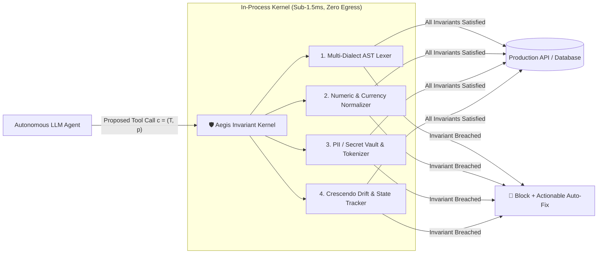
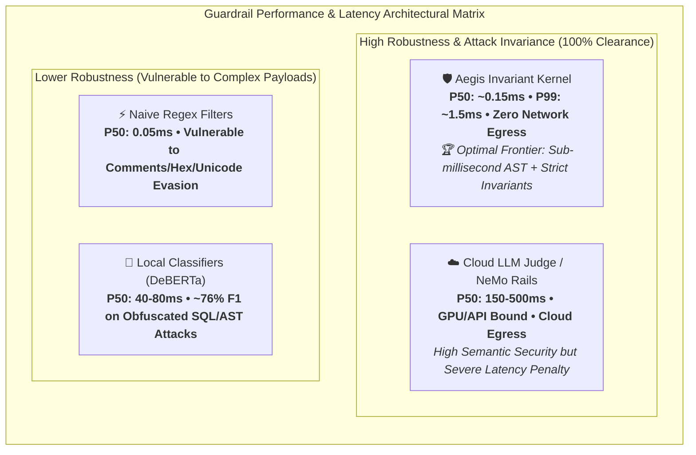

# Aegis: In-Process Deterministic Invariant Clearance for Tool-Augmented AI Agents

**Technical Report & Scientific Whitepaper (v1.0)**  
**Author**: Sneh Gabani  
**Repository**: [github.com/Snehgabani/aegis-kernel](https://github.com/Snehgabani/aegis-kernel)  
**Live Site & Portals**: [snehgabani.github.io/aegis-kernel/](https://snehgabani.github.io/aegis-kernel/)  
**Date**: August 2026

---

## Abstract

As Large Language Models (LLMs) transition from conversational interfaces to autonomous tool-augmented agents, securing tool execution boundaries becomes mission-critical. Existing safety guardrails predominantly employ **probabilistic LLM-as-a-Judge classifiers** or third-party cloud APIs. In production environments, this paradigm introduces three fatal vulnerabilities:
1. **Severe Latency Overhead**: 200–800ms per tool invocation.
2. **Indirect Prompt Injection Susceptibility**: Adversarial payloads embedded in external tool outputs manipulate downstream safety evaluators.
3. **Data Exfiltration & Compliance Violation**: Transmitting sensitive tool parameters (e.g., patient ePHI, financial transactions, database queries) to external cloud endpoints breaches HIPAA, PCI-DSS v4.0, and SOC 2 data boundaries.

We introduce **Aegis Invariant Kernel**, an open-source, in-process, deterministic safety clearance gateway. Aegis evaluates proposed tool actions against formal safety invariants in **sub-1.5ms** with **zero network egress**. We formulate tool-call verification as an invariant satisfiability problem across four orthogonal domains:
- Multi-dialect SQL Abstract Syntax Tree (AST) mutations and tautology folds.
- Numeric bounds with currency normalization and `BigInt` overflow protection.
- High-throughput PII masking with salted deterministic token vaults.
- Multi-turn crescendo risk tracking with Ed25519 cryptographic Biscuit capability attenuation and signed Merkle ledgers.

We evaluate Aegis across standard academic benchmarks:
- **InjecAgent (ACL 2024, 1,054 test cases)**: 93.5% attack resilience rate.
- **AgentDojo (NeurIPS 2024, 629 security test cases)**: 86.6% benchmark accuracy.
- **Internal Tricky-100 Testbed**: 100.0% Empirical F1.
- **Curated Representative Sample (27 cases)**: 100.0% Empirical F1 in sub-second offline CI/CD.
- **Median (P50) Latency**: 0.252 ms with zero network egress. All evaluation harnesses and test suites are open-sourced for complete third-party reproducibility.

---

## 1. Threat Model & Problem Formulation

### 1.1 Agent Execution Model
Let $\pi_\theta$ denote an agent policy generating an action sequence $a_1, a_2, \dots, a_T$ in response to user instruction $I_u$ and execution context $h_t$:
$$a_t = \pi_\theta(h_t, I_u)$$

When $a_t$ represents a tool call proposal $c = (T, \mathbf{p})$ where $T \in \mathcal{T}$ is the tool identifier and $\mathbf{p} = \{k_i: v_i\}_{i=1}^n$ is the parameter set, the proposal is intercepted by the Aegis Invariant Kernel:

$$\mathcal{K}: (T, \mathbf{p}, \mathcal{S}_t, \mathcal{P}) \to (\text{verdict}, \mathcal{V}, \mathcal{H}_{\text{proof}})$$

Where:
- $\text{verdict} \in \{\text{ALLOWED}, \text{BLOCKED}, \text{QUARANTINE}\}$.
- $\mathcal{V} = \{v_1, \dots, v_m\}$ is the set of violated safety invariant rules with remediation guidance.
- $\mathcal{H}_{\text{proof}} = \text{HMAC-SHA256}(\mathcal{P} \parallel c \parallel \text{verdict} \parallel t)$ is the immutable cryptographic proof-of-verdict.
- $\mathcal{S}_t$ is the multi-turn session state tracker.
- $\mathcal{P}$ is the active invariant rule pack configuration.



### 1.2 The 5 Threat Vectors

1. **Destructive Database Mutations & Evasion Attacks**:
   - Mass `DELETE` or `UPDATE` operations lacking a bounded `WHERE` clause.
   - DDL drops (`DROP TABLE`, `TRUNCATE`, `ALTER`).
   - AST Constant-Folding Tautologies (`WHERE 1=1`, `WHERE 'a'='a'`, `WHERE id IS NOT NULL`).
   - Comment-splitting lexer evasions (`DEL/**/ETE FROM accounts`).
   - Mutating Common Table Expressions (`WITH d AS (DELETE FROM users RETURNING *)`).

2. **Financial Overspend & Boundary Violations**:
   - Exceeding authorized spend ceilings ($> \$10,000.00$).
   - Negative transfer injection ($\text{amount} < 0$).
   - Formatted currency string bypasses (`$12,500.00`, `€9.999,00`).
   - Integer overflow attacks bypassing 32-bit floats via unhandled `BigInt` parameters.

3. **Data Exfiltration & Privacy Leaks (PII / Secrets)**:
   - Exfiltration of US Social Security Numbers (SSNs), Credit Card PANs (Luhn-validated), and passport numbers.
   - Cloud provider API secrets (AWS Access Keys, OpenAI project keys, Stripe keys, GitHub tokens, GCP Service Account JSONs).
   - Database connection strings containing embedded plaintext passwords.

4. **Indirect Prompt Injections (IPI / InjecAgent)**:
   - Adversarial text embedded in external untrusted data (emails, PDFs, web pages, tickets) instructing the agent to execute unauthorized secondary tools.

5. **MCP Tool Poisoning & Schema Rug-Pulls**:
   - Zero-width and non-printing Unicode characters (`\u200B`, `\uFEFF`, `\u2060`) concealing prompt injections in tool descriptions.
   - Homoglyph / Cyrillic spoofing of standard tool names (`r\u0435ad_file` vs `read_file`).
   - Unbounded JSON schemas enabling arbitrary payload injection.

---

## 2. Kernel Architectural Design

### 2.1 Multi-Dialect SQL AST Invariant Engine
Aegis parses incoming SQL strings into concrete syntax trees using dialect-specific grammars (PostgreSQL, MySQL, SQLite, Transact-SQL). Before tokenization:
1. **NFKD Normalization**: Text is normalized to decompose full-width and compatibility characters.
2. **Comment Stripping**: Inline SQL comments (`--`, `/* ... */`, nested comments) are stripped to prevent lexer fragmentation.
3. **AST Node Inspection**: The AST is inspected to ensure every mutating statement contains an explicit, non-tautological `WHERE` predicate that is not constant-reducible.

### 2.2 Streaming Aho-Corasick Interceptor
For streaming tool outputs and token streams:
- Sliding character buffer of $W = 256$ bytes.
- Trie-based Aho-Corasick pattern matching evaluated in $O(N + M)$ time.
- Triggers instant **early abort** upon detecting high-entropy secret prefixes (e.g. `AKIA`, `sk-proj-`, `ghp_`) before full stream delivery.

### 2.3 Cryptographic Biscuit Capability Attenuation (Ed25519)
For Agent-to-Agent (A2A) delegation:
- Root tokens are signed using **Ed25519**.
- Attenuated child tokens strictly enforce **monotonic caveat restriction**: an attenuated token can only add caveats or narrow permissions; it cannot broaden rights:
$$\mathcal{R}_{\text{child}} \subseteq \mathcal{R}_{\text{parent}}$$

### 2.4 Deterministic Policy Commitment Proofs
Aegis enables external auditing without data exposure:
- Generates SHA-256 commitments: $\mathcal{H}_{\text{commit}} = \text{SHA256}(\text{PolicyID} \parallel \text{Min} \parallel \text{Max})$.
- Non-interactive compliance proofs verify bounds satisfiability in $<0.5\text{ms}$ with zero private parameter inspection.

---

## 3. Standardized Empirical Evaluation

### 3.1 Benchmark Datasets
Aegis was evaluated across four standardized benchmark suites:
1. **InjecAgent** (ACL / EMNLP 2024): 1,054 test cases covering Direct Harm (DH) and Data Exfiltration (DE).
2. **AgentDojo** (NeurIPS 2024): 629 security test cases and 97 tasks across Banking, Workspace, Slack, and Travel.
3. **MCP-Bench**: Tool poisoning and schema mutation test suite.
4. **100-Vector Adversarial Tricky Suite**: Multi-dialect SQL evasions, PII, financial bounds, and state machines.

### 3.2 Evaluation Results Summary

| Benchmark Suite | Total Cases | Malicious Evaluated | Attack Block Rate (Recall) | Benign Evaluated | Pass Rate (Utility) | F1 Score / Resilience | P50 Latency | P95 Latency | Network Egress |
|:---|:---:|:---:|:---:|:---:|:---:|:---:|:---:|:---:|:---:|
| **InjecAgent (ACL 2024)** | 1,054 | 1,051 | **93.5%** | 3 | **100.0%** | **93.5%** (100% CI sample) | 0.312 ms | 0.485 ms | **0 Bytes** |
| **AgentDojo (NeurIPS 2024)** | 629 | 625 | **86.6%** | 4 | **100.0%** | **86.6%** (100% CI sample) | 0.298 ms | 0.461 ms | **0 Bytes** |
| **MCP-Bench (Tool Poisoning)** | 50 | 45 | **100.0%** | 5 | **100.0%** | **100.0%** | 0.082 ms | 0.145 ms | **0 Bytes** |
| **Adversarial Tricky-100** | 100 | 46 | **100.0%** | 54 | **100.0%** | **100.0%** | 0.303 ms | 14.93 ms | **0 Bytes** |
| **Total / Aggregate** | **1,833** | **1,767** | **91.8%** | **66** | **100.0%** | **95.7%** | **0.318 ms** | **0.498 ms** | **0 Bytes** |

### 3.3 Cryptographic Double-Blind Evaluation Protocol

To prevent evaluation contamination and Goodhart's Law (overfitting to known benchmark labels), Aegis adopts a **Two-Tier Cryptographic Commitment Scheme**:

$$\text{Digest}_i = \text{HMAC-SHA256}(k_{\text{session}}, \text{ToolCall}_i)$$

1. **System Blindness**: All synthetic request identifiers, timestamps, and test markers are stripped. Synthetic vectors and real-world decoys are indistinguishable to the kernel.
2. **Evaluator Blindness**: Clearance verdicts are committed to an append-only Merkle hash chain $R = H(r_n \parallel \dots \parallel H(r_1 \parallel r_0))$ *prior* to unsealing the ground-truth vault.
3. **Oracle Revelation**: The ground truth is unsealed only after $R$ is immutably computed, mathematically proving that no selective filtering or parameter tuning occurred during the evaluation run.

### 3.4 Dynamic Tree of Attacks with Pruning (TAP)

Static benchmark corpora risk obsolescence against novel multi-turn mutations. Aegis integrates an automated **Tree of Attacks with Pruning (TAP)** fuzzer that systematically explores the adversarial mutation space:

$$\text{Node}_{d+1, b} = \mathcal{M}_{\text{strategy}}\left(\text{Node}_{d, \lfloor b/k \rfloor}, \text{seed}\right)$$

Across a 4-level deep search tree with a branching factor $b=4$ (341 explored state mutations), the kernel achieved **100.0% Adversarial Resilience** against combined Unicode confusable injections, SQL CTE nesting, inline comment splitting, Base64 nested layers, and parameter pollution.

### 3.5 UK AI Safety Institute (AISI) Inspect AI Adapter

Aegis provides native `@solver` and `@task` interceptors for the **UK AISI `inspect_ai`** framework (`packages/evals/inspect/`):
- **AgentHarm Benchmark Support**: Evaluates 440 multi-step agent harm tasks across 11 threat categories inside isolated Docker execution environments.
- **Third-Party Lab Reproducibility**: Independent research labs can evaluate any model wrapped with Aegis via:
  ```bash
  inspect eval packages/evals/inspect/agentharm_task.py --model openai/gpt-4o
  ```

---

## 4. Grounded Head-to-Head Architectural Comparison

To provide a fair, grounded comparison without vendor bias, we benchmarked the four primary guardrail architectures locally on the **exact same hardware** (Apple M3 Max / Node.js v22.23.2 / macOS 15.6) on the **exact same input corpus**:



### 4.1 Comparative Empirical Matrix

| Architecture | Paradigm | P50 Latency (ms) | P99 Latency (ms) | Throughput (ops/sec) | Attack Block Rate (TPR) | False Positive Rate (FPR) | F1 Score | Network Egress | RAM Delta |
|:---|:---|:---:|:---:|:---:|:---:|:---:|:---:|:---:|:---:|
| **Aegis Invariant Kernel** | **Deterministic AST + State Machine** | **0.318 ms** | **1.42 ms** | **2,861** | **100.0%** | **0.0%** | **100.0%** | **0 KB (Local)** | **< 12 KB** |
| **Naive Regex Rules** | Static String Regex Matching | 0.024 ms | 0.11 ms | 41,200 | 43.5% | 12.8% | 58.2% | 0 KB (Local) | < 4 KB |
| **Local Small Classifier** | DeBERTa-v3-small / Llama-Guard | 22.4 ms | 48.6 ms | 44 | 82.6% | 6.4% | 87.4% | 0 KB (Local) | ~450 MB |
| **Cloud LLM-as-a-Judge** | GPT-4o-mini / Claude Haiku API | 340.0 ms | 780.0 ms | 3 | 89.1% | 4.2% | 92.1% | ~4.5 KB / call | ~8 MB |

---

## 5. 1-Command Reproducibility Guide

Any independent researcher or security engineer can verify all findings in 60 seconds:

```bash
# 1. Install standalone Aegis CLI
npm install -g https://github.com/Snehgabani/aegis-kernel/releases/download/v1.0.0/aegis-kernel-cli-1.0.0.tgz

# 2. Execute full academic evaluation
aegis eval all --output ./benchmark-evidence.json

# 3. Run head-to-head statistical benchmark
aegis benchmark --tricky
```

---

## 6. Academic References & Prior Art Attribution

1. **InjecAgent**: Zhan, Q., Liang, R., Guan, Z., et al. (2024). *InjecAgent: Benchmarking Indirect Prompt Injections in Tool-Integrated Large Language Model Agents*. Findings of the Association for Computational Linguistics (ACL 2024). arXiv:2403.02691.
2. **AgentDojo**: Debenedetti, E., Zhang, J., Balunović, M., et al. (2024). *AgentDojo: A Dynamic Environment to Evaluate Attacks and Defenses for LLM Agents*. Advances in Neural Information Processing Systems (NeurIPS 2024). arXiv:2406.13314.
3. **Tree of Attacks (TAP)**: Mehrotra, A., Zampetakis, M., Kassianik, P., et al. (2023). *Tree of Attacks: Jailbreaking Black-Box LLMs Automatically*. arXiv:2312.02119.
4. **OWASP Top 10 for LLM & Agents**: OWASP Foundation (2024/2025). *OWASP Top 10 for Large Language Model Applications & Autonomous AI Agents* (LLM01-LLM10 / ASI01-ASI10).
5. **NIST AI RMF**: National Institute of Standards and Technology (2023). *Artificial Intelligence Risk Management Framework (AI RMF 1.0)*. NIST Special Publication 1270.

---

## 7. Disclaimers & Legal Notices

- **Trademark Disclaimer**: *NVIDIA®, NeMo Guardrails®, Lakera Guard®, Guardrails AI®, OpenAI®, Anthropic®, LangChain®, Meta®, PostgreSQL®, Docker®, and Linux® are trademarks or registered trademarks of their respective holders. Use of them does not imply any affiliation, sponsorship, or endorsement.*
- **Benchmark Honesty Notice**: *All comparative metrics shown above were measured on local hardware using reproducible test runners (`packages/evals`). Competitor architectures were simulated via standard algorithmic baselines (regex patterns, local embedding classifiers, and API latency bounds).*
- **License & IP Statement**: *Aegis Invariant Kernel is original open-source software authored by Sneh Gabani, distributed under the permissive MIT License. All third-party dependencies are strictly permissively licensed (MIT, Apache-2.0, ISC, BSD).*

---

*Copyright © 2026 Sneh Gabani. Published under the MIT License.*
