# Show HN / Product Hunt Launch Manifesto

**Title**: Show HN: Aegis Invariant Kernel – Deterministic Tool-Call Safety for AI Agents in <1.5ms

**Link**: `https://github.com/Snehgabani/aegis-kernel`  
**Live Studio Demo**: `https://github.com/Snehgabani/aegis-kernel/blob/main/site/playground.html`

---

## 🎯 The Pitch

Hi HN! I built **Aegis Invariant Kernel** ([GitHub](https://github.com/Snehgabani/aegis-kernel)) — an open-source, in-process deterministic clearance kernel that protects production databases, financial APIs, and systems from rogue AI agent actions in **sub-1.5ms** with zero network egress.

### The Problem with Existing AI Guardrails

Most existing AI guardrails (Guardrails AI, NeMo, Lakera) use **probabilistic LLM-as-a-Judge classifiers** or cloud APIs. In practice, this causes three fatal production issues:

1. **Massive Latency Tax**: Calling an LLM or cloud API to verify a tool call adds 200–800ms to every agent step.
2. **Jailbreak Vulnerability**: An LLM judge can be manipulated by indirect prompt injections inside tool arguments (e.g. `DEL/**/ETE FROM users WHERE 1=1` or zero-width unicode obfuscations).
3. **Data Exfiltration & Privacy**: Sending internal tool arguments to third-party cloud APIs violates strict HIPAA, PCI-DSS, and SOC 2 data boundary controls.

### How Aegis Solves This Deterministically

Aegis takes a **zero-trust, deterministic compiler approach**:

```mermaid
flowchart LR
    subgraph INGRESS["🤖 Autonomous AI Agents & Frameworks"]
        direction TB
        A1["LangChain / CrewAI / AutoGen"]
        A2["OpenAI Function Calling / Swarm"]
        A3["Anthropic Claude Tool Use"]
        A4["Model Context Protocol (MCP)"]
    end

    INGRESS -->|Tool-Call Proposal| PIPELINE

    subgraph PIPELINE["🛡️ Aegis In-Process Clearance Pipeline (<1.5ms, Zero Network Egress)"]
        direction TB
        
        subgraph T1["1. Lexical & Ingress Guard"]
            L1["Aho-Corasick Streaming Interceptor"]
            L2["Unicode NFKD / Confusable Sanitizer"]
            L3["Zero-Egress Prompt Injection Classifier"]
        end

        subgraph T2["2. Structural AST & Semantic Engine"]
            S1["Multi-Dialect SQL AST Parser<br/>(Postgres, MySQL, SQLite, T-SQL)"]
            S2["Numeric Risk Bounds & Safe BigInts"]
            S3["PII Token Vault (16-Byte Salt Anonymizer)"]
            S4["Policy-as-Code Engine (Cedar / Rego AST)"]
        end

        subgraph T3["3. Temporal & Identity Topology"]
            C1["Agent Identity & RBAC Policy Manager"]
            C2["Ed25519 Biscuit Monotonic Attenuation"]
            C3["Causal Execution DAG (Anti-Exfiltration)"]
            C4["Crescendo Multi-Turn Drift Tracker"]
        end

        subgraph T4["4. Cryptographic Proofs & Decision Hub"]
            D1["SHA-256 ProofHash & Merkle GRC Ledger"]
            D2["EU AI Act Plain-English Explainer"]
            D3["Self-Healing AST Auto-Fix Generator"]
        end

        T1 --> T2 --> T3 --> T4
    end

    T4 -->|Verdict: ALLOWED| OUT_ALLOW[("🎯 Production DB / APIs<br/>+ SHA-256 Proof Hash")]
    T4 -->|Verdict: BLOCKED / REASK| OUT_BLOCK["💥 LLM Auto-Fix Re-Ask Feedback<br/>+ SIEM Alert & Quarantine"]
```



1. **Multi-Dialect AST Invariants**: Compiles SQL arguments into Abstract Syntax Trees across PostgreSQL, MySQL, SQLite, and TransactSQL. Detects tautological `WHERE 1=1` constant folds, recursive mutating CTEs (`WITH deleted AS (DELETE ...)`), and comment-splitting evasion attacks (`DEL/**/ETE`).
2. **Numeric Risk Boundaries**: Enforces strict financial ceilings and velocity limits, normalizing formatted currencies (`$12,500.00`) and safely parsing `BigInt` values while explicitly rejecting `NaN` and `Infinity`.
3. **Enterprise PII & Secrets Detection**: High-throughput regex & NFKD normalization detecting JWTs, GCP Service Account keys, database URIs with passwords, IBANs, and credit cards in tool arguments and return payloads.
4. **Self-Healing LLM Feedback**: When an invariant is violated, Aegis returns a structured auto-fix suggestion (`Avoid using 'DROP'. Use targeted updates instead.`) so the agent automatically self-corrects on the next turn without failing the user session.
5. **Universal Framework Support**:
   - **TypeScript / Node.js**: `@aegis-kernel/core`, `@aegis-kernel/mcp`, `@aegis-kernel/openai`, `@aegis-kernel/anthropic`, `@aegis-kernel/langchain`.
   - **Python 3.9+**: Pure Python `aegis-kernel` package with `@aegis_guard` decorator (zero external dependencies).

---

## ⚡ Quick 5-Second Demo

```bash
# Clone & run interactive demo
git clone https://github.com/Snehgabani/aegis-kernel.git
cd aegis-kernel
npm install
./scripts/demo.sh
```

Or test in Python:
```python
from aegis_kernel import aegis_guard

@aegis_guard(tool_name="database_exec")
def execute_sql(query: str):
    # Automatically blocked if query contains mass DELETE without WHERE or DROP TABLE
    return db.execute(query)
```

---

## 📊 Empirical Benchmarks (10,000 Evaluations)

- **Throughput**: 2,861 evaluations/second (single core)
- **Median Latency (P50)**: 0.318 ms
- **95th Percentile Latency (P95)**: 0.498 ms
- **Empirical F1 Score**: 100.0% across 100 tricky adversarial vectors (10 threat domains).

All code is open-source under the MIT License on [GitHub](https://github.com/Snehgabani/aegis-kernel). We’d love to hear your feedback, bug reports, or edge-case attacks!
