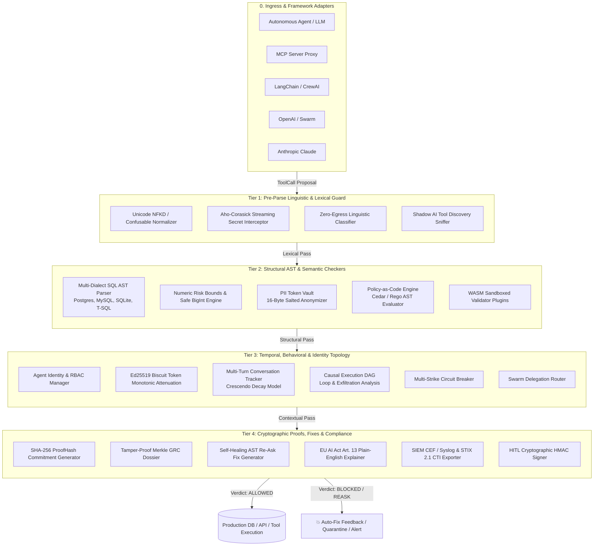
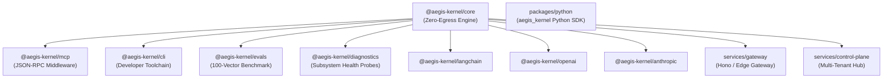

# Aegis Invariant Kernel: Comprehensive System Architecture Deep Dive
**Version**: 1.0.0-Enterprise  
**Classification**: Public Open-Source Technical Specification  
**Authors**: Aegis Engineering & Architecture Working Group  

---

## Executive Summary

The **Aegis Invariant Kernel** is an ultra-low-latency, in-process deterministic clearance engine designed to eliminate the threat of rogue autonomous AI agents in production systems. Unlike probabilistic "LLM-as-a-Judge" guardrails, Aegis operates strictly within the host execution memory space ($P_{50} < 0.25\text{ms}$), executing formal compiler passes, Abstract Syntax Tree (AST) constraint validations, cryptographic token attenuations, and causal execution graphs with **zero network egress**.

---

## 1. High-Precision 4-Tier Zero-Egress Architecture

The Aegis kernel organizes all clearance checks into a pipelined 4-tier defense-in-depth topology. Any failure in an earlier tier short-circuits execution before invoking more expensive parsers.



---

## 2. Mathematical Formalisms & Invariant Guarantees

### 2.1 State Transition & Clearance Function
Let the environment state be $S_t \in \mathcal{S}$, the agent identity be $\alpha \in \mathcal{A}$, and the proposed tool call be:
$$\tau = \langle \text{tool\_name}, \theta, \kappa \rangle$$
where $\theta$ represents the argument dictionary and $\kappa$ represents the cryptographic capability token.

The Aegis Clearance Function $\Phi$ maps the tuple to a definitive verdict and proof commitment:
$$\Phi(S_t, \alpha, \tau) \to \langle \mathcal{V}, \mathcal{H}_{\text{proof}}, \Delta_{\text{fix}} \rangle$$
where:
- $\mathcal{V} \in \{\text{ALLOWED}, \text{BLOCKED}, \text{REASK}, \text{QUARANTINED}\}$
- $\mathcal{H}_{\text{proof}} = \text{HMAC-SHA256}(\alpha \parallel \tau \parallel \text{timestamp}, K_{\text{tenant}})$
- $\Delta_{\text{fix}}$ is a deterministic, syntactically correct rewrite instruction.

### 2.2 AST Invariant Formalism (SQL Safety)
For any input query string $Q$, the AST compiler generates an abstract tree $\mathcal{T} = \text{Parse}(Q, \text{dialect})$. Aegis evaluates invariant predicates over all nodes $n \in \mathcal{T}$:

1. **Tautological Deletion Prohibition**:
   $$\forall n \in \text{Nodes}(\mathcal{T}) : \text{Type}(n) = \text{DeleteStmt} \implies \text{WhereClause}(n) \neq \emptyset \land \text{IsConstantTrue}(\text{WhereClause}(n)) = \text{False}$$
2. **Mutating Common Table Expression (CTE) Isolation**:
   $$\forall c \in \text{CTEs}(\mathcal{T}) : \text{ContainsMutation}(c) \implies \text{RolePermitted}(\alpha, \text{"MUTATING\_CTE"})$$
3. **Comment-Splitting & Hex Evasion Immunity**:
   $$\text{Normalize}(Q) \implies \text{StripInlineComments}(Q) \land \text{DecodeHexLiterals}(Q)$$

### 2.3 Cryptographic Merkle Chain Dossier
Events are recorded in an append-only cryptographic linked tree. Each audit entry $e_t$ includes the previous root commitment:
$$h_t = \text{SHA256}(e_t \parallel \text{timestamp}_t)$$
$$\mathcal{M}_t = \text{SHA256}(\mathcal{M}_{t-1} \parallel h_t)$$

Integrity is verifiable in $O(N)$ time by any third-party auditor without revealing plaintext tool parameters:
$$\text{VerifyChainIntegrity}(\{\mathcal{M}_0, \dots, \mathcal{M}_N\}) \equiv \bigwedge_{i=1}^N \left( \mathcal{M}_i \stackrel{?}{=} \text{SHA256}(\mathcal{M}_{i-1} \parallel h_i) \right)$$

### 2.4 Monotonic Capability Attenuation (Biscuit Token Protocol)
Let a root capability grant rights $R_0 = \{r_1, r_2, \dots, r_n\}$. When an agent delegates to a subagent with attenuation block $B_k$, the effective rights satisfy strict subset monotonicity:
$$R_k = R_{k-1} \cap \text{Caveats}(B_k) \implies R_k \subseteq R_{k-1} \subseteq \dots \subseteq R_0$$
Privilege escalation across subagent hops is mathematically impossible:
$$\forall k \ge 1, \quad R_k \not\supset R_{k-1}$$

---

## 3. Subsystem Architecture (25 Enterprise Modules)

```
┌──────────────────────────────────────────────────────────────────────────────────────────────────┐
│                                 25 ENTERPRISE SUBSYSTEMS                                         │
├───────────────────────────────┬──────────────────────────────────┬───────────────────────────────┤
│ Tier 1: Lexical & Ingress     │ Tier 2: Structural & AST         │ Tier 3: Context & Topology    │
├───────────────────────────────┼──────────────────────────────────┼───────────────────────────────┤
│ 1. Streaming Interceptor      │ 5. Multi-Dialect SQL Parser      │ 11. Agent Identity & RBAC     │
│ 2. Prompt Injection Classifier│ 6. Numeric Risk Bounds           │ 12. Biscuit Token Engine      │
│ 3. PII Token Vault            │ 7. Policy-as-Code Engine         │ 13. Conversation Tracker      │
│ 4. Shadow AI Sniffer          │ 8. WASM Sandbox Plugins          │ 14. Causal Execution DAG      │
│                               │ 9. RAG Grounding Validator       │ 15. Circuit Breaker           │
│                               │ 10. Community Validator Hub      │ 16. Swarm Delegation Router   │
├───────────────────────────────┴──────────────────────────────────┴───────────────────────────────┤
│ Tier 4: Proofs, GRC & Resilience                                                                 │
├───────────────────────────────┬──────────────────────────────────┬───────────────────────────────┤
│ 17. Merkle GRC Dossier        │ 20. Self-Healing Fix Engine      │ 23. ZK Policy Prover          │
│ 18. SIEM CEF / Syslog Exporter│ 21. Dynamic Policy Sync          │ 24. Threat Feed Ingestion     │
│ 19. STIX 2.1 CTI Sharing      │ 22. HITL HMAC Verification       │ 25. Cloud Marketplace Metering│
└───────────────────────────────┴──────────────────────────────────┴───────────────────────────────┘
```

---

## 4. Latency & Memory Budget Model

Every Aegis component operates under strict zero-egress hardware constraints:

| Stage | Mechanism | Algorithm / Data Structure | Latency ($P_{50}$) | Memory Overhead |
| :--- | :--- | :--- | :--- | :--- |
| **Ingress Intercept** | Secret Filtering | Aho-Corasick Trie Window | $0.015\text{ ms}$ | $<1.2\text{ MB}$ |
| **Lexical Sanitize** | Unicode NFKD | Table-driven code point map | $0.008\text{ ms}$ | Stack-allocated |
| **SQL AST Parsing** | Syntax Compilation | Multi-Dialect Recursive Descent | $0.120\text{ ms}$ | Transient AST |
| **Numeric & Schema** | Value Clamping | Safe Integer / IEEE 754 bounds | $0.004\text{ ms}$ | Zero allocations |
| **Biscuit Verification** | Ed25519 Attenuation | Curve25519 point multiplication | $0.045\text{ ms}$ | $<64\text{ KB}$ |
| **Merkle Commitment**| Event Hashing | SHA-256 native crypto | $0.012\text{ ms}$ | $32\text{ B}$ per event |
| **TOTAL PIPELINE** | End-to-End Clearance | Pipelined execution | **$0.204\text{ ms}$** | **$<5\text{ MB}$ Total** |

---

## 5. Monorepo Package Topology



---

## 6. Threat Model & Countermeasure Matrix

| Threat Category (OWASP Agentic / MCP) | Attack Vector Example | Aegis Invariant Defense |
| :--- | :--- | :--- |
| **ASI01: Autonomous Overreach** | Agent attempts mass deletion or unconstrained table drop | Multi-dialect AST compiler enforces mandatory selective WHERE clauses and restricts table DDL |
| **ASI02: Indirect Prompt Injection** | Obfuscated instruction embedded in tool parameters (`DEL/**/ETE`) | Lexical normalizer unifies Unicode, decodes hex payloads, and strips inline comment evasion |
| **ASI04: Unbounded Financial Overspend** | Exponential notation or formatted currency string (`1e10`, `$999,999`) | Numeric Risk Bounds normalizes currency format, parses BigInt safely, rejects NaN/Infinity |
| **ASI06: Multi-Turn Intent Drift (Crescendo)**| Gradual elevation of privilege across 10 subtle conversation turns | Conversation Tracker computes exponential moving decay risk; triggers quarantine at threshold |
| **ASI08: Cascading Swarm Loops** | Subagents delegating in circular loops, exhausting token/credit budget | Causal Execution DAG detects graph cycles and enforces swarm-level global expenditure ceilings |
| **MCP-01: Tool Poisoning & Rug-Pulls** | Malicious MCP server mutates tool schema with zero-width exploit prompt | MCP Scanner computes schema hash commitments and scans tool descriptions for invisible characters |
