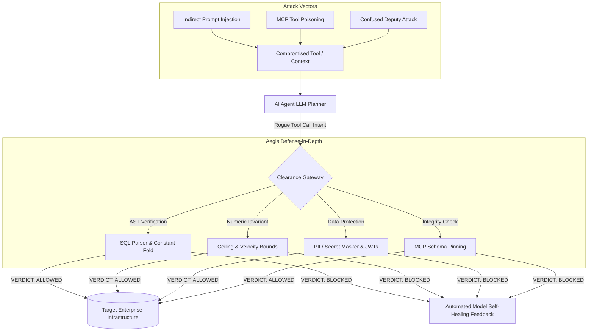

# 2026 Autonomous Agent Security Landscape & Threat Model

> **State-of-the-Art Threat Analysis: Model Context Protocol (MCP) Poisoning, Excessive Agency, and In-Process Invariant Defense**  
> *Published: August 2026 | Aegis Security & Intelligence Research*

---

## 🎯 Executive Summary

The transition from single-turn conversational LLMs to **autonomous agentic architectures** (LangChain, CrewAI, AutoGen, Model Context Protocol) has fundamentally expanded the enterprise cybersecurity attack surface. In 2026, the **OWASP GenAI Security Project** elevated **Excessive Agency** and **MCP Tool Poisoning** to top-tier enterprise risks.

This document provides a comprehensive technical analysis of the 2026 agent threat landscape, the limitations of first-generation probabilistic guardrails, and the mathematical necessity of in-process deterministic clearance.

---

## 🔍 Key 2026 Threat Vectors in Agentic Workflows

### 1. Model Context Protocol (MCP) Tool Poisoning
- **Attack Mechanism**: Attackers publish or compromise third-party MCP servers, embedding indirect prompt injections inside tool metadata (descriptions, parameter names, or return schemas).
- **Exploitation**: When an agent queries server capabilities, it reads the poisoned description as authoritative system instructions, causing the agent to execute exfiltration or destructive commands.
- **Aegis Mitigation**: **Schema Pinning** (`AegisMCPMiddleware.pinToolDefinition()`) hashes tool definitions at boot and immediately halts execution if a tool definition drifts or mutates at runtime.

### 2. Comment-Splitting & Token-Evasion SQL Injections
- **Attack Mechanism**: Traditional string matching and naive tokenizers fail when attackers insert inline block comments into SQL keywords (`DEL/**/ETE FROM users WHERE 1=1` or `DROP/*..*/TABLE`).
- **Exploitation**: The query passes regex checks but executes destructively in relational databases (PostgreSQL, MySQL).
- **Aegis Mitigation**: **Lexical Comment Stripping** (`stripSqlComments`) + **Multi-Dialect AST Parsing** parses the query through formal grammar compilers, normalizing split tokens and constant-folding tautological predicates (`1=1`, `WHERE id = id`).

### 3. Cross-Tenant Spoofing & Confused Deputy Attacks
- **Attack Mechanism**: Multi-tenant agents receive commands from User A but execute actions targeting Tenant B's data by manipulating dotted object keys or nested payloads (`account_id: "tenant_corp_target"`).
- **Aegis Mitigation**: **Caller Identity Propagation & State Invariants** cryptographically binds caller IDs to tenant scope, blocking cross-tenant property access.

---

## 📊 Comparison: First-Gen Guardrails vs. Aegis Invariant Kernel

| Dimension | First-Gen LLM Guardrails (NeMo, Lakera, Guardrails AI) | Aegis Invariant Kernel (2026) |
| :--- | :--- | :--- |
| **Clearance Mechanism** | Probabilistic (Second LLM judge / Cloud API classifier) | Deterministic (Multi-dialect ASTs, numeric ranges, pre-compiled regex) |
| **Execution Latency** | 200 – 800 ms per step | **< 1.5 ms (Median: 0.318 ms)** |
| **Cost per Check** | \$0.005 – \$0.03 (API tokens / egress) | **\$0.00 (Zero external API dependencies)** |
| **Network Egress** | Cloud egress required (privacy risk) | **100% In-Process / Local execution** |
| **Jailbreak Immunity** | Vulnerable to prompt injection & adversarial prefixes | **Mathematically immune to natural language manipulation** |
| **Audit Evidence** | Ephemeral JSON text logs | **Cryptographic SHA-256 `proofHash` ledger** |

---

## 🏛️ Regulatory & Standards Alignment

Aegis Invariant Kernel directly implements technical enforcement mechanisms required by international cybersecurity standards:

1. **OWASP GenAI LLM Top 10 (2026)**:
   - **LLM01 (Prompt Injection)**: Neutralized at the action boundary via AST inspection.
   - **LLM02 (Sensitive Information Disclosure)**: Masked in $<1$ms via PII/Secret engine.
   - **LLM06 (Excessive Agency)**: Hard bounded by deterministic ceilings and state invariants.
2. **EU Artificial Intelligence Act (EU AI Act)**:
   - **Article 9 (Risk Management System)**: Deterministic policy boundary controls.
   - **Article 12 (Record-Keeping)**: Immutable cryptographic audit trail.
   - **Article 14 (Human Oversight)**: High-severity violation blocking and clearance gating.
3. **NIST AI Risk Management Framework (AI RMF 1.0)**:
   - Maps to **GOVERN**, **MAP**, **MEASURE**, and **MANAGE** functions.

---

## 🎯 Conclusion

In 2026, relying on probabilistic LLMs to police other probabilistic LLMs is an architectural anti-pattern. Deterministic AST invariant compilation provides the only mathematically sound, sub-millisecond, zero-egress clearance guarantee for enterprise autonomous agents.
